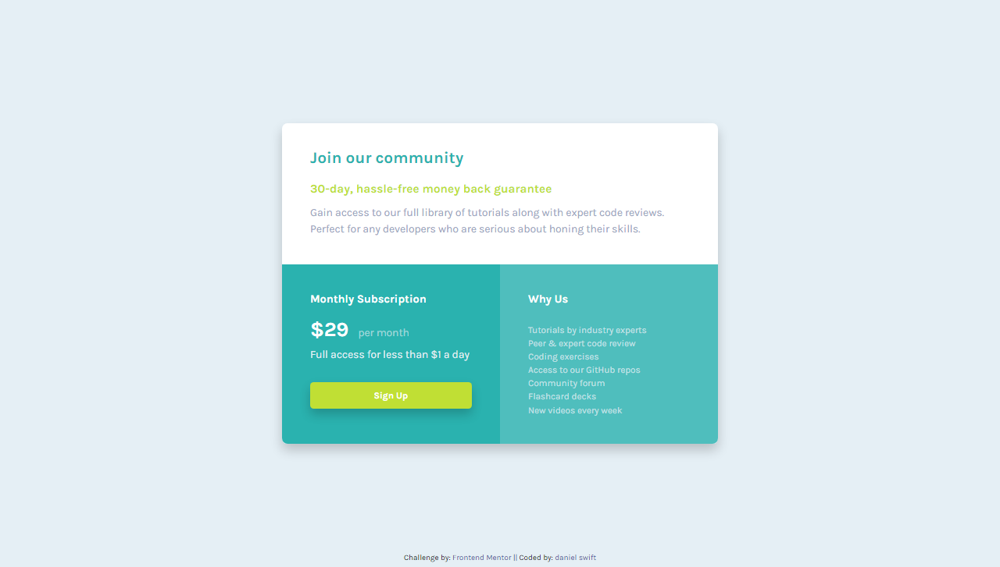

# Frontend Mentor - Single price grid component solution

This is a solution to the [Single price grid component challenge on Frontend Mentor](https://www.frontendmentor.io/challenges/single-price-grid-component-5ce41129d0ff452fec5abbbc). Frontend Mentor challenges help you improve your coding skills by building realistic projects. 

## Table of contents

- [Overview](#overview)
  - [The challenge](#the-challenge)
  - [Screenshot](#screenshot)
  - [Links](#links)
- [My process](#my-process)
  - [Built with](#built-with)
  - [Useful resources](#useful-resources)
- [Author](#author)
- [Acknowledgments](#acknowledgments)

## Overview

### The challenge

Users should be able to:

- View the optimal layout for the component depending on their device's screen size
- See a hover state on desktop for the Sign Up call-to-action

### Screenshot

### Links

- Solution URL: [Add solution URL here](https://your-solution-url.com)
- Live Site URL: [swift price grid component master](https://swfit-single-price-grid-component-master.netlify.app)

## My process

### Built with

- Semantic HTML5 markup
- CSS custom properties
- Flexbox
- Mobile-first workflow

### Useful resources
[Frontend Mentor] - (https://www.frontendmentor.io/) - Improve your Front-End skills my building projects

## Author

- Website - [danielswift10](https://github.com/danielswift10)
- Frontend Mentor - [@danielswift10](https://www.frontendmentor.io/profile/danielswift10)
- Twitter - [@swift_fingers_](https://twitter.com/swift_fingers_)

## Acknowledgments
Special Thanks goes to my creator, God the Almighty!